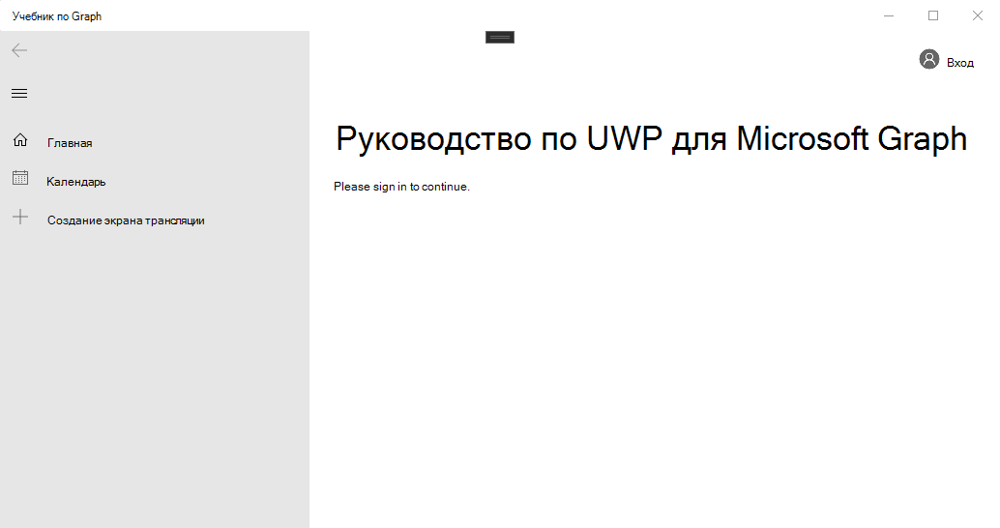

<!-- markdownlint-disable MD002 MD041 -->

Откройте Visual Studio и выберите **файл > создать проект >**. В диалоговом окне **Новый проект** выполните следующие действия:

1. Выберите **шаблоны > Visual C# > Windows Universal**.
1. Выберите **пустое приложение (универсальные окна)**.
1. Введите **Graph — руководство** по имени проекта.


> [!IMPORTANT]
> Убедитесь, что вы вводите точно такое же имя для проекта Visual Studio, которое указано в этих инструкциях лаборатории. Имя проекта Visual Studio становится частью пространства имен в коде. Код в этих инструкциях зависит от пространства имен, которое соответствует имени проекта Visual Studio, указанного в данных инструкциях. Если вы используете другое имя проекта, код не будет компилироваться, если не настроить все пространства имен в качестве имени проекта Visual Studio, вводимого при создании проекта.

Нажмите кнопку **ОК**. В диалоговом окне **новый универсальный проект платформы Windows** убедитесь, что для `Windows 10 Fall Creators Update (10.0; Build 16299)` **минимальной версии** задано значение, или более поздней, а затем нажмите кнопку **ОК**.

Прежде чем переходить, установите некоторые дополнительные пакеты NuGet, которые будут использоваться позже.

- [Microsoft. Toolkit. UWP. UI. Controls](https://www.nuget.org/packages/Microsoft.Toolkit.Uwp.Ui.Controls/) для добавления элементов управления пользовательского интерфейса для уведомлений в приложении и загрузки индикаторов.
- [Microsoft. Toolkit. UWP. UI. Controls. DataGrid](https://www.nuget.org/packages/Microsoft.Toolkit.Uwp.Ui.Controls.DataGrid/) для отображения сведений, возвращенных Microsoft Graph.
- [Microsoft. Toolkit. UWP. UI. Controls. Graph](https://www.nuget.org/packages/Microsoft.Toolkit.Uwp.Ui.Controls.Graph/) для обработки извлечения маркера входа и доступа.
- [Microsoft. Graph](https://www.nuget.org/packages/Microsoft.Graph/) для совершения вызовов в Microsoft Graph.

Выберите **инструменты > диспетчер пакетов NuGet > консоли диспетчера пакетов**. В консоли диспетчера пакетов введите указанные ниже команды.

```Powershell
Install-Package Microsoft.Toolkit.Uwp.Ui.Controls
Install-Package Microsoft.Toolkit.Uwp.Ui.Controls.DataGrid
Install-Package Microsoft.Toolkit.Uwp.Ui.Controls.Graph
Install-Package Microsoft.Graph
```

## <a name="design-the-app"></a>Проектирование приложения

Для начала добавьте переменную уровня приложения для отслеживания состояния проверки подлинности. В обозревателе решений разверните узел **app. XAML** и откройте **app.XAML.CS**. Добавьте в `App` класс следующее свойство.

```cs
public bool IsAuthenticated { get; set; }
```

Затем определите макет главной страницы. Откройте `MainPage.xaml` и замените все содержимое приведенным ниже.

```xml
<Page
    x:Class="graph_tutorial.MainPage"
    xmlns="http://schemas.microsoft.com/winfx/2006/xaml/presentation"
    xmlns:x="http://schemas.microsoft.com/winfx/2006/xaml"
    xmlns:local="using:graph_tutorial"
    xmlns:d="http://schemas.microsoft.com/expression/blend/2008"
    xmlns:mc="http://schemas.openxmlformats.org/markup-compatibility/2006"
    xmlns:controls="using:Microsoft.Toolkit.Uwp.UI.Controls"
    xmlns:graphControls="using:Microsoft.Toolkit.Uwp.UI.Controls.Graph"
    mc:Ignorable="d"
    Background="{ThemeResource ApplicationPageBackgroundThemeBrush}">

    <Grid>
        <NavigationView x:Name="NavView"
            IsSettingsVisible="False"
            ItemInvoked="NavView_ItemInvoked">

            <NavigationView.Header>
                <graphControls:AadLogin x:Name="Login"
                    HorizontalAlignment="Left"
                    View="SmallProfilePhotoLeft"
                    AllowSignInAsDifferentUser="False"
                    />
            </NavigationView.Header>

            <NavigationView.MenuItems>
                <NavigationViewItem Content="Home" x:Name="Home" Tag="home">
                    <NavigationViewItem.Icon>
                        <FontIcon Glyph="&#xE10F;"/>
                    </NavigationViewItem.Icon>
                </NavigationViewItem>
                <NavigationViewItem Content="Calendar" x:Name="Calendar" Tag="calendar">
                    <NavigationViewItem.Icon>
                        <FontIcon Glyph="&#xE163;"/>
                    </NavigationViewItem.Icon>
                </NavigationViewItem>
            </NavigationView.MenuItems>

            <StackPanel>
                <controls:InAppNotification x:Name="Notification" ShowDismissButton="true" />
                <Frame x:Name="RootFrame" Margin="24, 0" />
            </StackPanel>
        </NavigationView>
    </Grid>
</Page>
```

Этот параметр определяет базовую [навигатионвиев](https://docs.microsoft.com/uwp/api/windows.ui.xaml.controls.navigationview) с **домашними** и **календарными** ссылками навигации, которые действуют в качестве основного представления приложения. Кроме того, в заголовке представления добавляется элемент управления [аадлогин](https://docs.microsoft.com/dotnet/api/microsoft.toolkit.uwp.ui.controls.graph.aadlogin?view=win-comm-toolkit-dotnet-stable) . Этот элемент управления позволит пользователю выполнить вход и выход. Элемент управления еще не полностью включен, его можно настроить в ходе следующего упражнения.

Теперь добавьте еще одну страницу XAML для представления "Домашняя страница". Щелкните правой кнопкой мыши проект **Graph – Tutorial** в обозревателе решений и выберите команду **Добавить > новый элемент..**.. Выберите **пустая страница**, `HomePage.xaml` введите в поле **имя** и нажмите кнопку **Добавить**. Добавьте следующий код внутри `<Grid>` элемента в файле.

```xml
<StackPanel>
    <TextBlock FontSize="44" FontWeight="Bold" Margin="0, 12">Microsoft Graph UWP Tutorial</TextBlock>
    <TextBlock x:Name="HomePageMessage">Please sign in to continue.</TextBlock>
</StackPanel>
```

Теперь разверните **MainPage. XAML** в обозревателе решений и откройте `MainPage.xaml.cs`его. Добавьте следующий код в `MainPage()` конструктор **после** `this.InitializeComponent();` строки.

```cs
// Initialize auth state to false
SetAuthState(false);

// Navigate to HomePage.xaml
RootFrame.Navigate(typeof(HomePage));
```

При первом запуске приложения выполняется инициализация состояния проверки подлинности на `false` домашнюю страницу и переход на нее.

Добавьте указанную ниже функцию в `MainPage` класс для управления состоянием проверки подлинности.

```cs
private void SetAuthState(bool isAuthenticated)
{
    (App.Current as App).IsAuthenticated = isAuthenticated;

    // Toggle controls that require auth
    Calendar.IsEnabled = isAuthenticated;
}
```

Добавьте следующий обработчик событий для загрузки запрашиваемой страницы, когда пользователь выбирает элемент в представлении навигации.

```cs
private void NavView_ItemInvoked(NavigationView sender, NavigationViewItemInvokedEventArgs args)
{
    var invokedItem = args.InvokedItem as string;

    switch (invokedItem.ToLower())
    {
        case "calendar":
            throw new NotImplementedException();
            break;
        case "home":
        default:
            RootFrame.Navigate(typeof(HomePage));
            break;
    }
}
```

Сохраните все изменения, нажмите клавишу **F5** или выберите **Отладка > начать отладку** в Visual Studio.

> [!NOTE]
> Убедитесь, что выбрана соответствующая конфигурация для вашего компьютера (ARM, x64, x86).


