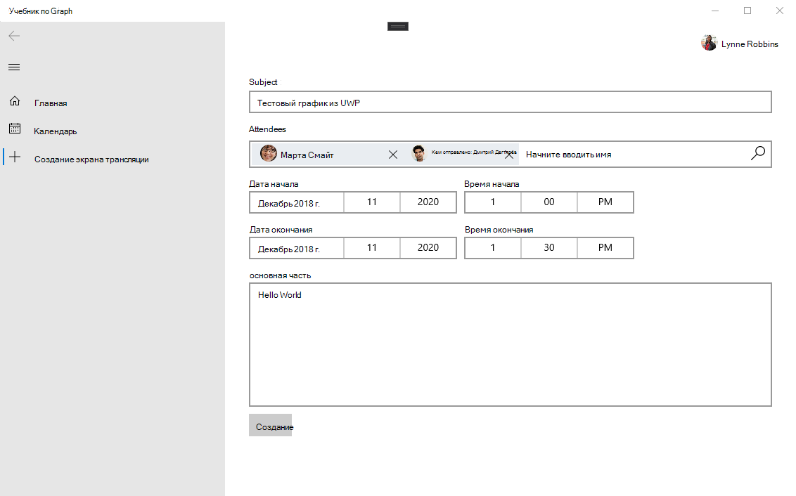

<!-- markdownlint-disable MD002 MD041 -->

<span data-ttu-id="b813c-101">В этом разделе вы добавим возможность создания событий в календаре пользователя.</span><span class="sxs-lookup"><span data-stu-id="b813c-101">In this section you will add the ability to create events on the user's calendar.</span></span>

1. <span data-ttu-id="b813c-102">Добавьте новую страницу для нового представления событий.</span><span class="sxs-lookup"><span data-stu-id="b813c-102">Add a new page for the new event view.</span></span> <span data-ttu-id="b813c-103">Щелкните правой кнопкой мыши проект **GraphTutorial** в обозревателе решений и **выберите "Добавить > Новый элемент...".** Выберите **пустую страницу,** `NewEventPage.xaml` введите в поле **"Имя"** и выберите **"Добавить".**</span><span class="sxs-lookup"><span data-stu-id="b813c-103">Right-click the **GraphTutorial** project in Solution Explorer and select **Add > New Item...**. Choose **Blank Page**, enter `NewEventPage.xaml` in the **Name** field, and select **Add**.</span></span>

1. <span data-ttu-id="b813c-104">Откройте **NewEventPage.xaml** и замените его содержимое на следующее.</span><span class="sxs-lookup"><span data-stu-id="b813c-104">Open **NewEventPage.xaml** and replace its contents with the following.</span></span>

    :::code language="xaml" source="../demo/GraphTutorial/NewEventPage.xaml" id="NewEventPageXamlSnippet":::

1. <span data-ttu-id="b813c-105">Откройте **NewEventPage.xaml.cs** и добавьте следующие утверждения в `using` верхнюю часть файла.</span><span class="sxs-lookup"><span data-stu-id="b813c-105">Open **NewEventPage.xaml.cs** and add the following `using` statements to the top of the file.</span></span>

    :::code language="csharp" source="../demo/GraphTutorial/NewEventPage.xaml.cs" id="UsingStatementsSnippet":::

1. <span data-ttu-id="b813c-106">Добавьте интерфейс **INotifyPropertyChange** в **класс NewEventPage.**</span><span class="sxs-lookup"><span data-stu-id="b813c-106">Add the **INotifyPropertyChange** interface to the **NewEventPage** class.</span></span> <span data-ttu-id="b813c-107">Замените существующее объявление класса на следующее.</span><span class="sxs-lookup"><span data-stu-id="b813c-107">Replace the existing class declaration with the following.</span></span>

    ```csharp
    public sealed partial class NewEventPage : Page, INotifyPropertyChanged
    {
        public NewEventPage()
        {
            this.InitializeComponent();
            DataContext = this;
        }
    }
    ```

1. <span data-ttu-id="b813c-108">Добавьте следующие свойства в **класс NewEventPage.**</span><span class="sxs-lookup"><span data-stu-id="b813c-108">Add the following properties to the **NewEventPage** class.</span></span>

    :::code language="csharp" source="../demo/GraphTutorial/NewEventPage.xaml.cs" id="PropertiesSnippet":::

1. <span data-ttu-id="b813c-109">Добавьте следующий код, чтобы получить часовой пояс пользователя из Microsoft Graph при загрузке страницы.</span><span class="sxs-lookup"><span data-stu-id="b813c-109">Add the following code to get the user's time zone from Microsoft Graph when the page loads.</span></span>

    :::code language="csharp" source="../demo/GraphTutorial/NewEventPage.xaml.cs" id="LoadTimeZoneSnippet":::

1. <span data-ttu-id="b813c-110">Добавьте следующий код для создания события.</span><span class="sxs-lookup"><span data-stu-id="b813c-110">Add the following code to create the event.</span></span>

    :::code language="csharp" source="../demo/GraphTutorial/NewEventPage.xaml.cs" id="CreateEventSnippet":::

1. <span data-ttu-id="b813c-111">Измените `NavView_ItemInvoked` метод в файле **MainPage.xaml.cs,** чтобы заменить существующий `switch` выписку на следующий.</span><span class="sxs-lookup"><span data-stu-id="b813c-111">Modify the `NavView_ItemInvoked` method in the **MainPage.xaml.cs** file to replace the existing `switch` statement with the following.</span></span>

    ```csharp
    switch (invokedItem.ToLower())
    {
        case "new event":
            RootFrame.Navigate(typeof(NewEventPage));
            break;
        case "calendar":
            RootFrame.Navigate(typeof(CalendarPage));
            break;
        case "home":
        default:
            RootFrame.Navigate(typeof(HomePage));
            break;
    }
    ```

1. <span data-ttu-id="b813c-112">Сохраните изменения и запустите приложение.</span><span class="sxs-lookup"><span data-stu-id="b813c-112">Save your changes and run the app.</span></span> <span data-ttu-id="b813c-113">Во sign in, select the **New event** menu item, fill in the form, and select **Create** to add an event to the user's calendar.</span><span class="sxs-lookup"><span data-stu-id="b813c-113">Sign in, select the **New event** menu item, fill in the form, and select **Create** to add an event to the user's calendar.</span></span>

    
